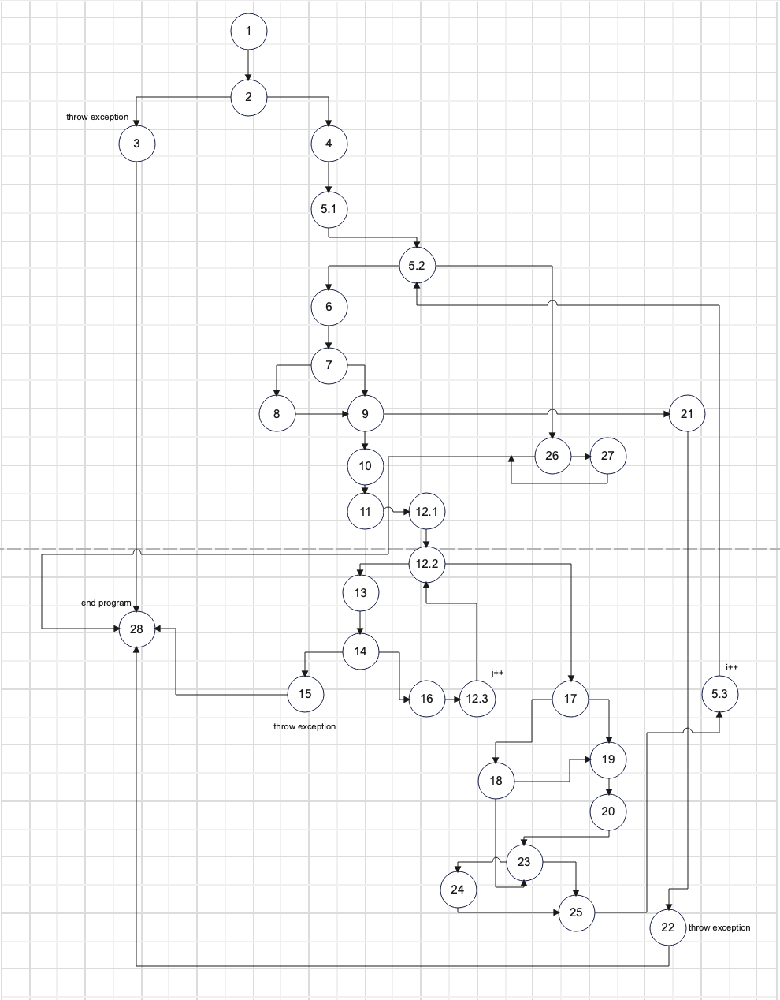

# SI_2024_lab2_215018
Done Donev 215018

Control Flow Graph

Цикломатска Комплексност

Цикломатската комплексност на дадениот код е 10, резултатот го добив според формулата P+1, каде P е бројот на предикатни јазли. Во овој случај P=9, па цикломатската комплексност изнесува 10.
Истиот резултат може и да се добие со формулата E - N + 2P, каде E ми е бројот на ребра a N ми е бројот на јазли, P ми е колку поврзани компоненти имам, во случајов имам 40 ребра и 32 јазли
со една поврзана компонента, така добив 40 - 32 +(2*1) = 10.
